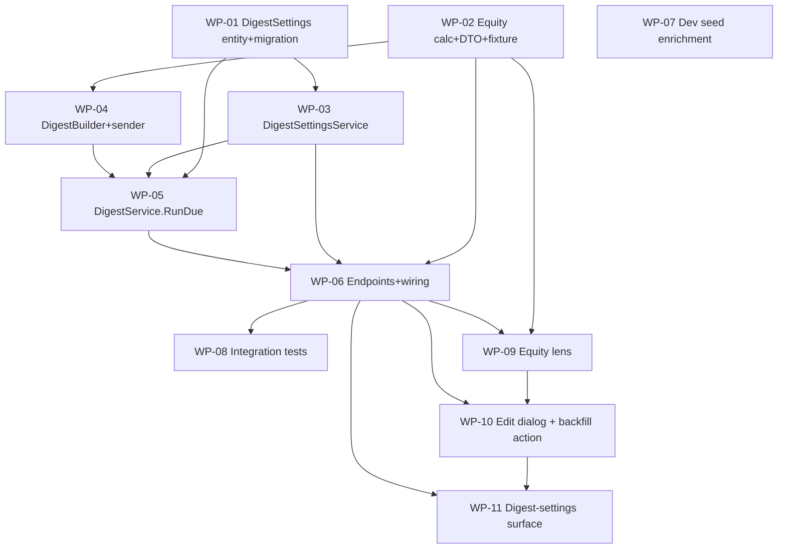

# Decomposition — Chores v1.1 (Equity View + Weekly Discord Digest)

11 packages, 9 waves, 1 project (family-coordination-app). Break pattern: API/Backend (WP-01…08) then UI
(WP-09…11). Each unit < ~2hrs, disjoint files within a wave, independently verifiable.

## Wave Plan

- **Wave 1:** WP-01 Digest-settings entity + migration *(schema first — everything settings-side depends on it)*
- **Wave 2:** WP-02 Equity calculator + DTO + fixture ∥ WP-03 DigestSettingsService (encryption) ∥ WP-07 Dev seed enrichment
- **Wave 3:** WP-04 DigestBuilder + sender (Discord + fake)
- **Wave 4:** WP-05 DigestService.RunDueAsync (orchestration)
- **Wave 5:** WP-06 Endpoints + Program.cs wiring (equity / settings / run-trigger / backfill / named HttpClient / token)
- **Wave 6:** WP-08 Integration tests (real Postgres)
- **Wave 7:** WP-09 Equity lens (island headline)
- **Wave 8:** WP-10 Edit-chore dialog + "load starter set" action (island)
- **Wave 9:** WP-11 Digest-settings surface (island)

### Wave rationale
- **W1** schema first. **W2** three disjoint files (calculator+DTO / settings service / seed) all ride only WP-01
  (or existing types). **W3** builder needs the equity calculator. **W4** orchestration needs entity+service+
  builder. **W5** endpoints + the single consolidated `Program.cs` edit (DI, named `HttpClient`, token config,
  endpoint mapping). **W6** integration tests after the wire contract exists. **W7–W9** island is sequential
  (same `frontend/chores/src/` files): equity lens → edit/backfill → settings surface.

## Gate Commands

- W1: `dotnet build src/FamilyCoordinationApp/FamilyCoordinationApp.csproj && dotnet ef migrations script --project src/FamilyCoordinationApp/FamilyCoordinationApp.csproj --no-build`
- W2–W4: `dotnet build … && dotnet test … --filter "kind!=integration"`
- W5: `dotnet build … && dotnet format … --verify-no-changes && dotnet test … --filter "kind!=integration"`
- W6: `dotnet test tests/FamilyCoordinationApp.Tests/FamilyCoordinationApp.Tests.csproj` *(full suite incl. integration — Docker required)*
- W7–W9: `cd frontend/chores && npm ci && npm run build && npx svelte-check`

## Decomposition test
- **<2hr each:** yes (each WP is one service/entity/component cluster).
- **Clear boundaries:** each WP lists exact files; `Program.cs` edits are consolidated into WP-06 only.
- **Independently verifiable:** each has its own gate (unit/contract/integration/island).
- **Disjoint files within a wave:** W2's three WPs touch different files (Services/ChoreEquity*, Services/
  DigestSettingsService, Data/SeedData); island WPs are sequential, not same-wave-parallel.
