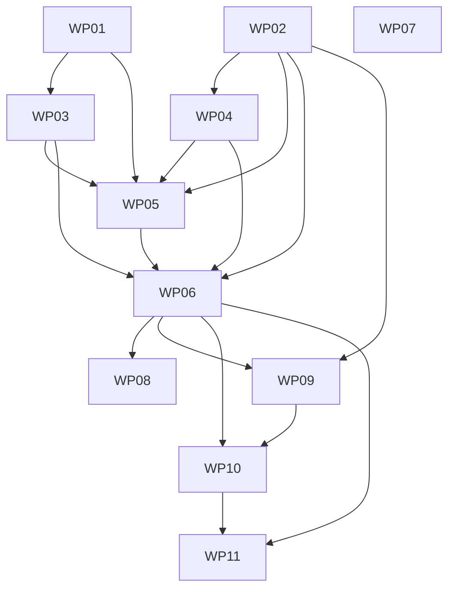

# Orchestrator — Chores v1.1 (Equity View + Weekly Discord Digest)

11 packages, 9 waves, 1 project (family-coordination-app). Extends the Phase 10 v1.0 spine (merged, live-dark).
Built **dark** behind `CHORES_USE_ISLAND`; shipped as one drop. **HOLD push/PR** until operator review (E8-op).

## Wave Plan

- Wave 1: [WP-01 Digest-settings entity + migration]
- Wave 2: [WP-02 Equity calculator+DTO+fixture] ∥ [WP-03 DigestSettingsService] ∥ [WP-07 Dev seed enrichment]
- Wave 3: [WP-04 DigestBuilder + sender]
- Wave 4: [WP-05 DigestService.RunDueAsync]
- Wave 5: [WP-06 Endpoints + Program.cs wiring]
- Wave 6: [WP-08 Integration tests]
- Wave 7: [WP-09 Equity lens]
- Wave 8: [WP-10 Edit dialog + backfill action]
- Wave 9: [WP-11 Digest-settings surface]

## Gate Commands
- W1: `dotnet build src/FamilyCoordinationApp/FamilyCoordinationApp.csproj && dotnet ef migrations script --project src/FamilyCoordinationApp/FamilyCoordinationApp.csproj --no-build`
- W2–W4: `dotnet build src/FamilyCoordinationApp/FamilyCoordinationApp.csproj && dotnet test tests/FamilyCoordinationApp.Tests/FamilyCoordinationApp.Tests.csproj --filter "kind!=integration"`
- W5: `dotnet build … && dotnet format src/FamilyCoordinationApp/FamilyCoordinationApp.csproj --verify-no-changes && dotnet test … --filter "kind!=integration"`
- W6: `dotnet test tests/FamilyCoordinationApp.Tests/FamilyCoordinationApp.Tests.csproj` *(full suite incl. integration — Docker)*
- W7–W9: `cd frontend/chores && npm ci && npm run build && npx svelte-check`

<!-- `dotnet ef` is a LOCAL tool; manifest at REPO ROOT dotnet-tools.json → `dotnet tool restore --tool-manifest dotnet-tools.json` first. Always `dotnet build` between `migrations add` and `migrations script`. -->

## Package Inventory

| Package | Wave | Execution | Spec |
|---|---|---|---|
| WP-01 Digest-settings entity + migration | 1 | autonomous | [wp-01](wp-01-digest-settings-entity.md) |
| WP-02 Equity calculator + DTO + fixture | 2 | autonomous | [wp-02](wp-02-equity-calculator-dto.md) |
| WP-03 DigestSettingsService (encryption) | 2 | review-needed | [wp-03](wp-03-digest-settings-service.md) |
| WP-04 DigestBuilder + sender | 3 | review-needed | [wp-04](wp-04-digest-builder-sender.md) |
| WP-05 DigestService.RunDueAsync | 4 | review-needed | [wp-05](wp-05-digest-run-service.md) |
| WP-06 Endpoints + Program.cs wiring | 5 | review-needed | [wp-06](wp-06-endpoints-wiring.md) |
| WP-07 Dev seed enrichment | 2 | autonomous | [wp-07](wp-07-dev-seed-enrichment.md) |
| WP-08 Integration tests | 6 | review-needed | [wp-08](wp-08-integration-tests.md) |
| WP-09 Equity lens | 7 | review-needed | [wp-09](wp-09-island-equity-lens.md) |
| WP-10 Edit dialog + backfill action | 8 | autonomous | [wp-10](wp-10-island-edit-backfill.md) |
| WP-11 Digest-settings surface | 9 | review-needed | [wp-11](wp-11-island-digest-settings.md) |

## Spec-Level Constraints (from constraints.md)

**Musts:** M1 HouseholdId isolation (run endpoint iterates server-side) · M2 DbContextFactory · M3 composite-key
idiom for the new entity · M4 gates clean · M5/M6 UTC+injected-TZ, no client date math · M7 equity DTO/fixture
lockstep, board untouched · M8 webhook encrypted at rest · M9 trigger token via header + fixed-time compare +
refuse-if-unconfigured · M10 digest idempotent + failure-isolated · M11 collective broadcast, no @mentions ·
M12 equity descriptive only · M13 additive migration · M14 named-HttpClient resilience · M15 DateTime Utc +
camelCase enums · M16 canonical `equity` lens id in lockstep.

**Must-Nots:** MN1 no BackgroundService (firing = cron→endpoint) · MN2 no circuit-bound liveness · MN3 no other
v1.1+ layers · MN4 don't perturb board DTO · MN5 no new columns on existing entities · MN6 don't touch
shopping-list/Docker stage · MN7 never log/return the webhook plaintext · MN8 no targeted nudges · MN9 no client
date math · MN10 run endpoint never unauthenticated / no query-string token · MN11 dev-only multi-member seed ·
MN12 don't auto-enable the flag in code · MN13 don't export reassigned `$state`.

**Escalation Triggers:** E1 roles (stop+flag) · E2 schema/infra beyond fence · **E3 firing reversal — if a
BackgroundService seems necessary, STOP for sign-off** · E4 CI Docker · E5 recurrence (no monthly-on-day) · E6
existing security · E7 secret handling (no plaintext fallback — STOP) · **E8 HOLD push/PR + don't flip the flag**.

## Cross-cutting verification
- After each backend WP: `dotnet build` + unit suite (`--filter "kind!=integration"`) green.
- After WP-08: full suite green WITH Docker; unit suite green WITHOUT.
- After each island WP: `npm run build` + `npx svelte-check` (NOT `tsc`).
- Equity DTO contract fixture (`equity.json`) green whenever the equity DTO or island `types.ts` changes; the
  board's `board.json` stays green unchanged (E1 isolation).

## Progress Log
<!-- Dispatch agents append entries here (read at start, append before finishing). -->

## Risk Assessment

**Primary risk: the digest seam (WP-05 + WP-06 + WP-08).** Idempotency (no double-post), multi-tenant
isolation, failure isolation, and the no-cookie token auth are the subtle parts. **Mitigation:** WP-05 isolates
the orchestration logic; WP-08 verifies idempotency/isolation/token on **real Postgres + the booted host** with
a fake sender (no live Discord). The one explicit architecture decision — **E8 reverses MN1** (cron→endpoint,
not a BackgroundService) — is gated for operator sign-off.

**Secondary risk: secret handling (WP-03/WP-04/WP-11).** The webhook URL must be encrypted at rest and never
logged/returned/displayed. **Mitigation:** M8/MN7 + E7 (no plaintext fallback — STOP); WP-03's `GetAsync`
returns a masked view; WP-04 suppresses `allowed_mentions`; tests assert the URL appears nowhere.

**Tertiary risk: equity framing drift** (a "distribution" silently becoming a leaderboard). **Mitigation:** M12/
MN8 + WP-05/WP-09 reviews; the v1.0 "escalate-to-visibility, never a nag" framing is the bar.

**Quaternary risk: contract/island drift** (equity DTO vs `types.ts`). **Mitigation:** the WP-02 `equity.json`
fixture + M7; `svelte-check` (not `tsc`) on island WPs.

## Dispatch Notes
- **Scope:** 1 new entity + migration; 1 pure calculator + DTO; 1 settings service (encryption); 1 builder +
  sender (+fake); 1 orchestration service; endpoints + ONE consolidated `Program.cs` edit (DI + named
  `HttpClient` + token config); dev-seed enrichment; integration tests; 3 sequential island WPs. Adds
  `.env.example` entries. Touches `Program.cs`, `ChoresEndpoints.cs`, `SeedData.cs`, `ApplicationDbContext.cs`,
  `ChoresWebAppFactory.cs`, and the island `frontend/chores/src/`.
- **Opus recommended** for WP-05 (orchestration), WP-06 (auth + Program.cs), WP-08 (integration), WP-09
  (primary UX). Others fit the default model.
- **All `Program.cs` edits consolidated into WP-06** (DI + HttpClient + token + endpoint map) — no same-wave
  collision. Island WPs (7–9) are sequential (same files).
- **GATE:** build is authorized only on **council convergence**. **HOLD** push/PR + the prod flag flip for the
  operator's review. Live Discord send + island click-through are manual-owed (GAP-1/GAP-2).
